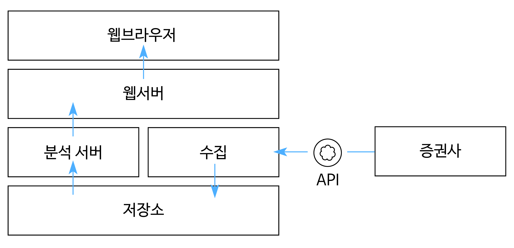

  # 2020-02-Capstone Design
  
  
## __프로젝트 주제__ 
### __주식 분석 시스템__

## __프로젝트 개요__ 
증권사에서 제공하는 데이터를 수집 및 가공하여 분석 알고리즘을 통해 투자전략을 세운다.

## __팀구성__

 

- 팀명 : ACSJ
- 지도교수 : 이원철
- 팀원 : 정현욱, 최창훈, 안수현, 서영화 
- 참여기업 : 디지캡

## __프로젝트 개발 환경__
VSCODE

## __프로젝트 개발 목표__
코로나 때문에 사람들의 이목이 주식에 집중된 상황이다. 새로운 주식 투자자들이 기존 투자자들에 비해 상대적으로 투자 근거가 대체적으로 부족하므로 도움을 주기 위해 증권사에서 제공하는 API를 이용하여 데이터를 수집한 후 저장한다. 수집한 주식 데이터를 다중선형회귀 분석을 통하여 데이터의 방향과 추세를 예측한 시스템을 구현한다. 두 번째로는 분석 시스템에서 구현한 내용을 웹으로 확인할 수 있게 화면 구성 하는 것이 최종적인 목표이다.   

## __시스템 구조__

 

### __프로젝트 구성__
1. 
